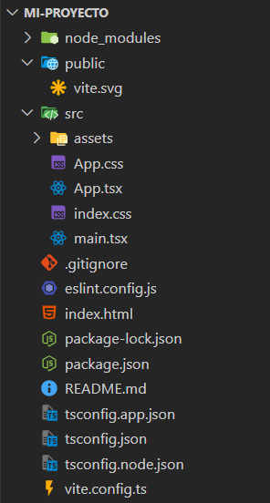

# 📌 Paso a paso para instalar y crear un proyecto con React + Vite
---

## 1. Instalar Node.js

* Ve a la página oficial: [Node.js](https://nodejs.org/)
* Descarga la versión LTS (Long Term Support), no la “Current”.
  * LTS es más estable y recomendada para proyectos en producción.
* Instala con las opciones por defecto.
* Para verificar:
```bash
node -v #Debera mostrar la versión del node que tienes instalado: "v22.20.0"
npm -v  #Debera mostrar la versión del npm que tienes instalado:  "10.9.3"
```

---

## 2. Crear un proyecto con Vite

En la terminal (CMD, PowerShell o terminal de VS Code):

```bash
cd ~/Documents                        # o cd C:\Users\TU_USUARIO\Documents en Windows
npm create vite@latest mi-proyecto  #Con lastest
```

```bash
cd ~/Documents                      # o cd C:\Users\TU_USUARIO\Documents en Windows
npm create vite@5.2.0 mi-proyecto  #Sin lastest
```

Nota:
* @latest está bien para aprender, pero puede dar incompatibilidades con tutoriales más viejos.
* Para proyectos serios en producción, es más seguro especificar una versión fija.

---

## 3. Responder las preguntas de Vite

---

### Pregunta #1

```bash
Need to install the following packages:
create-vite@8.0.2
Ok to proceed? (y)
```

* Escribir: `y`

---

### Pregunta #2

```bash
Select a framework:
```

* En este caso seleccionaremos `React`

---

### Pregunta #3

```bash
Select a variant:
```

* En este caso seleccionaremos `TypeScript + SWC`
* **Nota:** Elegir ya sea `JavaScript` o `TypeScript` con `SWC` 
* ¿Por qué?:
  * No cambia nada en tu forma de programar React.
  * Compila más rápido que TypeScript puro.
  * Es estable y usado en proyectos reales.

---

### Pregunta #4

```bash
 Use rolldown-vite (Experimental)?:
```

* En este caso seleccionaremos `No`

---

### Pregunta #5

```bash
 Install with npm and start now?
```

* En este caso seleccionaremos `Yes`

Y ya estaría, nos daria la dirección local (Servidor de desarrollo).

**Consejo:** Usa `Ctrl + J` para ocultar la terminal y que siga corriendo en segundo plano nuestro Servidor de desarrollo.

---


## 4. Arrancar el servidor de desarrollo

```bash
npm run dev
```
Vas a ver algo como:
```bash
VITE v5.x.x  ready in 400ms
➜  Local:   http://localhost:5173/
```

Ya con esto tienes:
* **Node.js** (motor de ejecución JS fuera del navegador).
* **npm** (gestor de dependencias).
* **React** (framework de UI).
* **Vite** (herramienta que configura y levanta todo rápido).

Tendrás un proyecto inicial de esta manera:


---

## 📌 Si ya tienes un proyecto creado
Ya con esto tienes:
* Abre VS Code.
* Abre la carpeta del proyecto.
* En la terminal de VS Code ejecuta:
```bash
npm install   # solo si acabas de clonar y no tienes node_modules
npm run dev
```
* Listo, se abre el servidor en `http://localhost:5173/`.

---

Made with ❤️ by **Alejo (DevByLualmara)**
